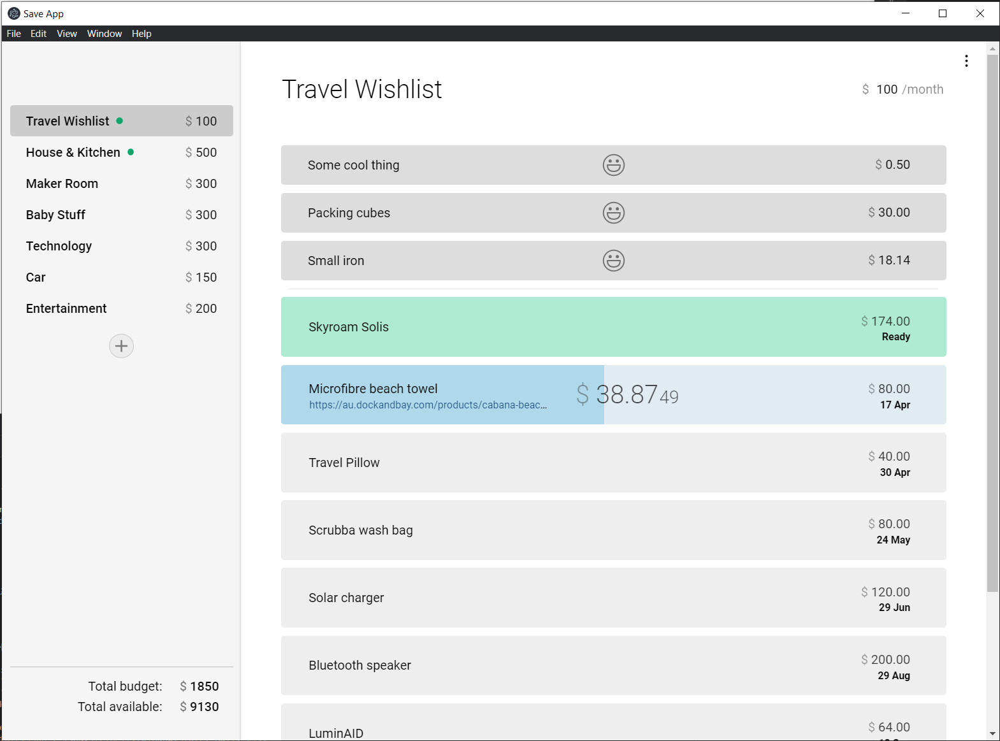

# Save App

A simple app to help to limit spending. You create a list of things you want, and specify how much money you want to budget for the list per month, and it counts money gradually towards each item until you've waited long enough to purchase it.

## Run

  - Clone repo
  - `npm run electron` (uses the file system for storage)
  - OR `npm run web-server` and open `localhost:8080` in a browser (uses web localStorage for storage)

